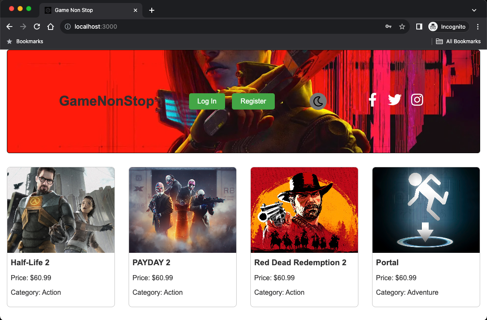
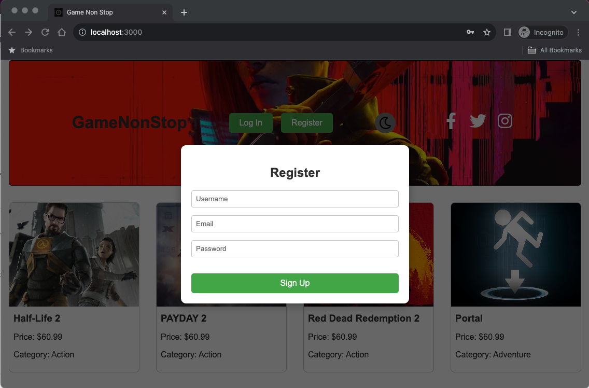
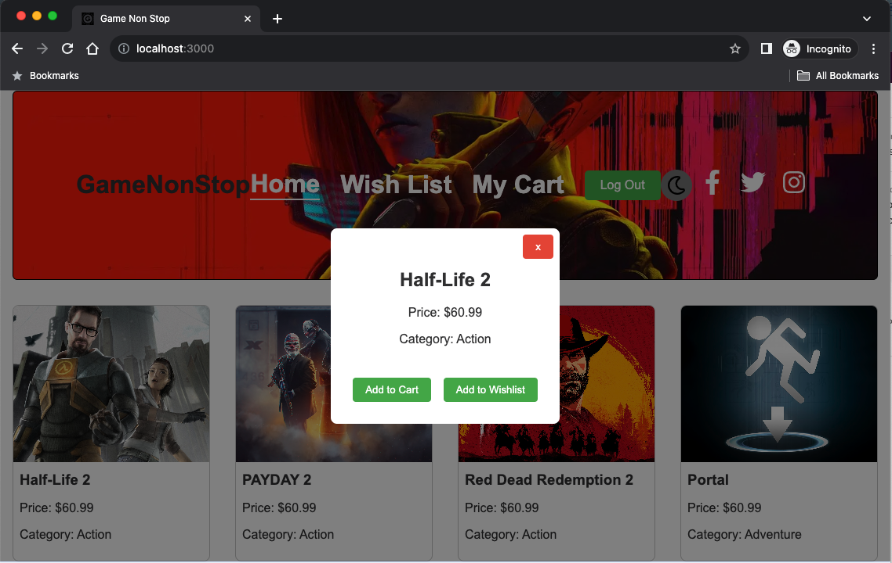

# GameNonStop
Welcome to GameNonStop, your ultimate destination for endless gaming! From the latest hits to timeless classics, we offer a vast selection of video games for all platforms, ensuring non-stop fun at unbeatable prices. Game on, non-stop, at GameNonStop! 

## Table of Contents
* [About the project](#about-the-project)
* [Concept](#concept)
* [User Story](#user-story)
* [Technologies Used](#technologies)
* [Installation](#installation)  
* [Usage](#usage)

## About the project
In this project, we embark on creating a cutting-edge MERN-stack single-page application, integrating the power of MongoDB, GraphQL, Express.js, and Node.js with a dynamic React front end. Central to this endeavor is the implementation of robust user authentication using JWT, ensuring a secure, user-centric experience. Embracing agile development methodologies, the code was diligently managed on GitHub, with project progression overseen.

Starting from the ground up, this project was an opportunity to refine our front-end skills with React and deepen your understanding of multi-server operations in a MERN framework. Our evolving expertise, shaped by previous projects, guide us to a nuanced approach to this application.

In this project we encompass:

* Front-end development with React.
* Back-end integration using GraphQL with a Node.js and Express.js server.
* Database management with MongoDB and Mongoose ODM.
* Functionalities for data retrieval, addition, updates, and deletion through queries and mutations.
* Deployment on Heroku with live data.
* A polished, responsive, and interactive user interface.
* JWT for authentication and server-side protection of API keys.
* A well-organized repository adhering to coding standards, including file structure, naming conventions, indentation, and high-quality documentation.
* A comprehensive README featuring the project’s name, description, technologies used, screenshots, and a link to the deployed application.
* This project is not just a testament to your technical skills but also a demonstration of your growth and adaptability in full-stack development.

## Concept

A Diverse, accessible gaming store with unbeatable deals.



## User Story

**As a** gaming enthusiast,
**I want** an online platform where I can easily explore and purchase a wide variety of video games,
**So that I** can enjoy a diverse gaming experience across different genres and platforms at competitive prices.

## Technologies Used


 


## Instalation

0. Run deployed app at: https://XXXXXX.XXXX.XXXX

1. Clone the repo
   ```sh
   git clone https://github.com/jonathanlunabiom/GameNonStop.git
   ```
2. Install NPM packages
   ```sh
   npm run install
   ```
3. Seed the database
   ```sh
   cd server
   npm run seed
   ```
4. run
   ```sh
   npm run develop
   ```

## Usage

1. Register for an account, select a Username, Email and Password for your new account:


2. Once registered, you would get access to your Wish List and My Cart components:



3. Click on your prefered title and send to your wish list or cart to buy. Ejoy your shopping!:



